# Інструкція для перевірки ДЗ: REST API (Тема 7)

## Як запустити проєкт

npm install

### Як перевірити роботу API + РЕЗУЛЬТАТ

## Запускаємо сервер

npm start

або в режимі розробки (якщо додав nodemon):

npm run dev

Структура проекту

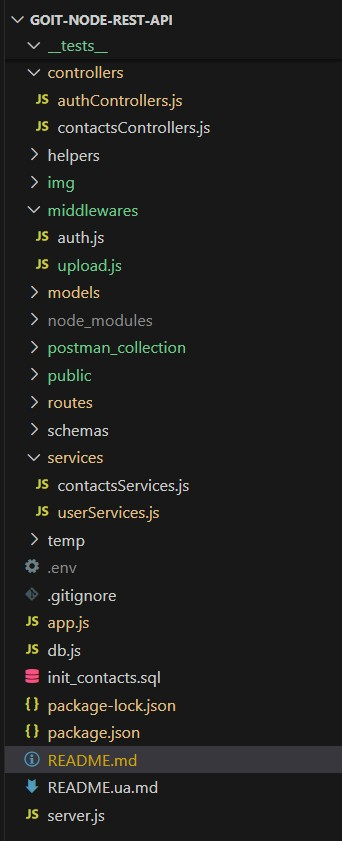

### Ендпоінти для перевірки

## Відкрий інший термінал і зроби кілька запитів

# Перевірка API через Postman (зручніше для перевірки)

Відкрий Postman

Імпортуй колекцію contacts_api.postman_collection.json

Там є готові запити:

GET /api/contacts

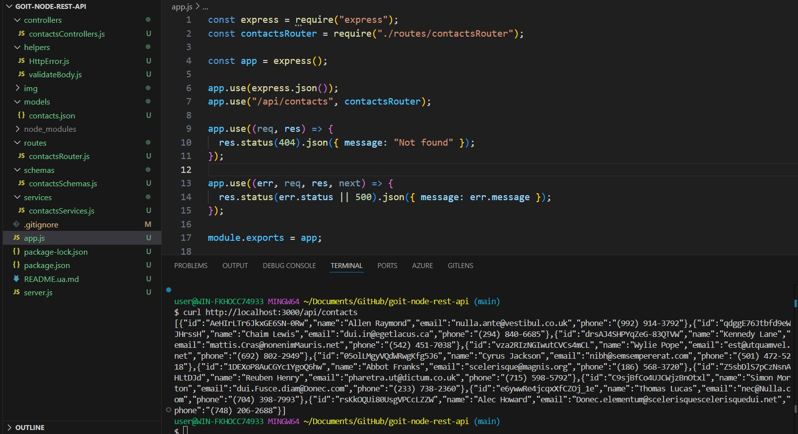

GET /api/contacts/:id

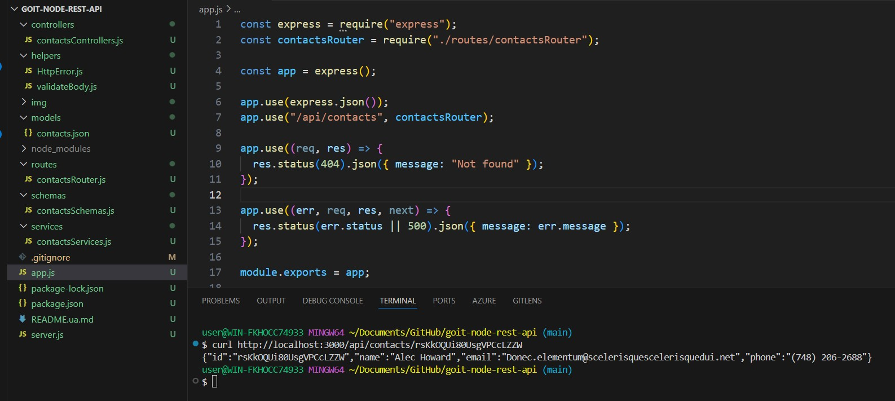

POST /api/contacts

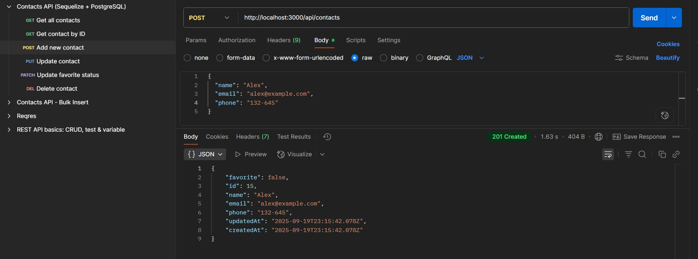

PUT /api/contacts/:id

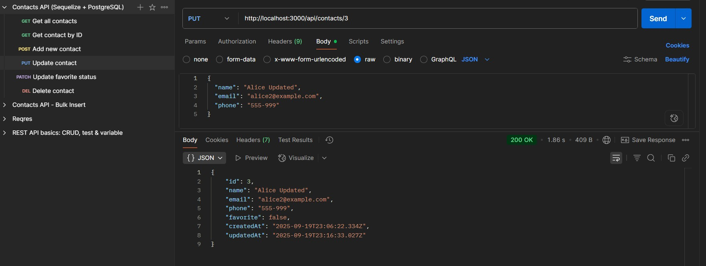

PATCH /api/contacts/:id/favorite

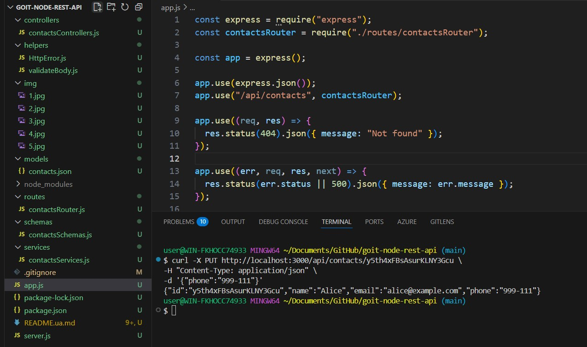

DELETE /api/contacts/:id

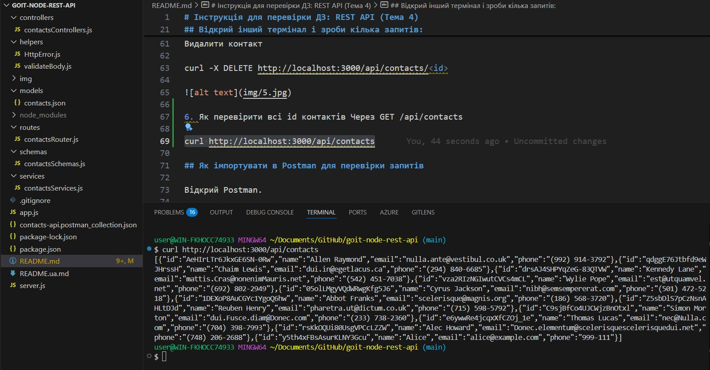

Запускай по черзі і дивись у відповідь (Response).

## Postman-запити для Auth API

# Реєстрація (Register)

POST http://localhost:3000/api/auth/register
Content-Type: application/json

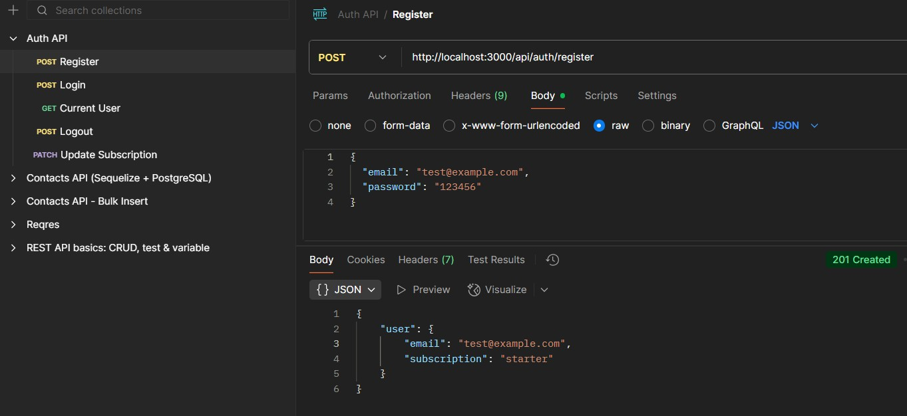

# Логін (Login)

POST http://localhost:3000/api/auth/login
Content-Type: application/json

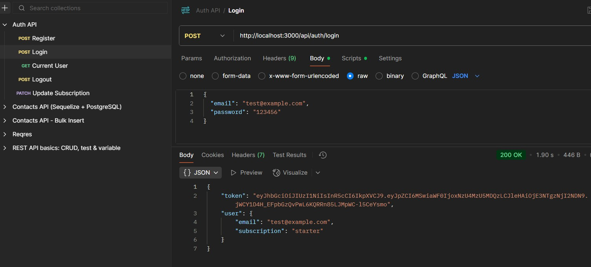

# Поточний користувач (Current User)

GET http://localhost:3000/api/auth/current
Authorization: Bearer JWT_TOKEN

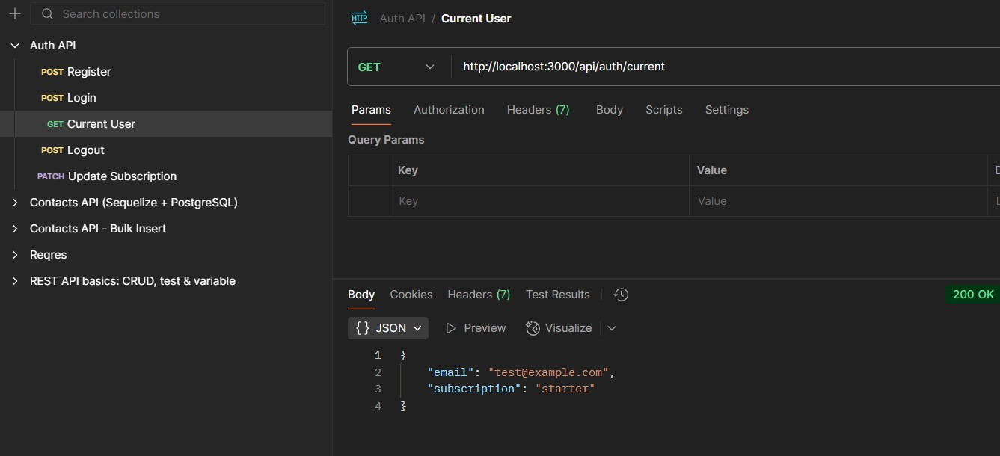

# Логаут (Logout)

POST http://localhost:3000/api/auth/logout
Authorization: Bearer JWT_TOKEN

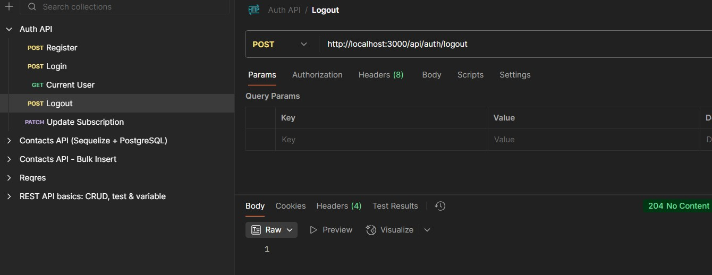

# Додатково: Оновлення підписки (Update Subscription)

PATCH http://localhost:3000/api/auth/subscription
Authorization: Bearer JWT_TOKEN
Content-Type: application/json

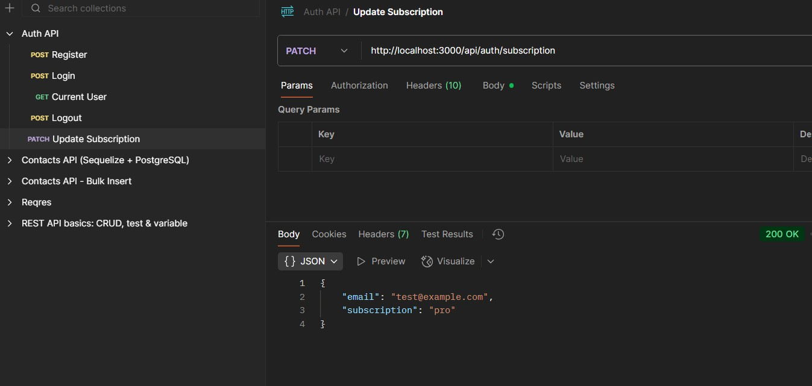
