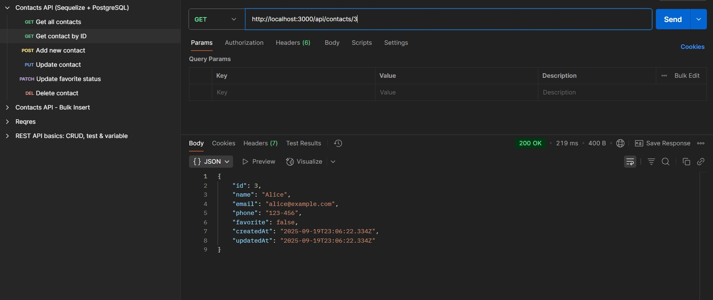
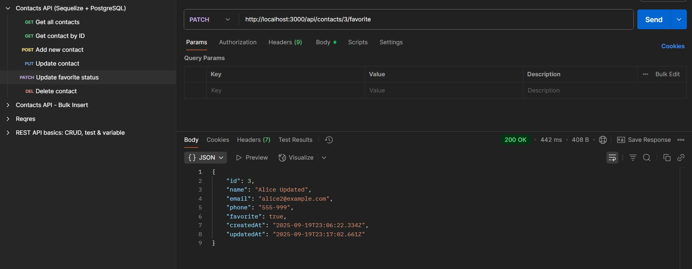

# Інструкція для перевірки ДЗ: REST API (Тема 4)

## Як запустити проєкт

npm install

### Як перевірити роботу API + РЕЗУЛЬТАТ

## Запускаємо сервер

npm start

або в режимі розробки (якщо додав nodemon):

npm run dev

### Ендпоінти для перевірки

## Відкрий інший термінал і зроби кілька запитів:

1. GET /api/contacts

Отримати всі контакти

curl http://localhost:3000/api/contacts

2. GET /api/contacts/:id

Отримати контакт за id

curl http://localhost:3000/api/contacts/<id>

3. POST /api/contacts

Створити новий контакт

curl -X POST http://localhost:3000/api/contacts \
-H "Content-Type: application/json" \
-d '{"name":"Alice","email":"alice@example.com","phone":"1234567"}'

4. PUT /api/contacts/:id

Оновити контакт

curl -X PUT http://localhost:3000/api/contacts/<id> \
-H "Content-Type: application/json" \
-d '{"phone":"999-111"}'

5. DELETE /api/contacts/:id

Видалити контакт

curl -X DELETE http://localhost:3000/api/contacts/<id>

6. Як перевірити всі id контактів Через GET /api/contacts

curl http://localhost:3000/api/contacts

## Як імпортувати в Postman для перевірки запитів

Відкрий Postman.

У верхньому меню натисни Import.

Обери файл contacts-api.postman_collection.json.

Тепер у тебе з’явиться колекція Contacts REST API.

Для перевірки GET /:id, PUT /:id, DELETE /:id заміни значення змінної {{contactId}} на реальний id з бази.
