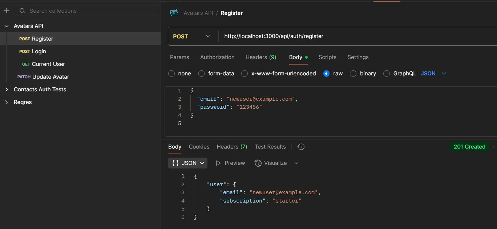
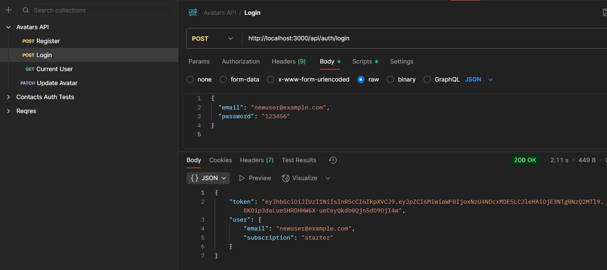
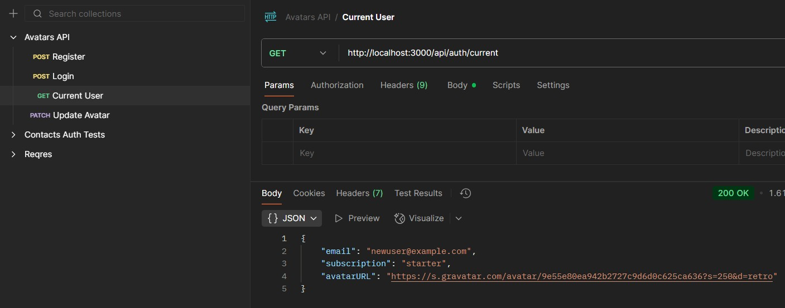
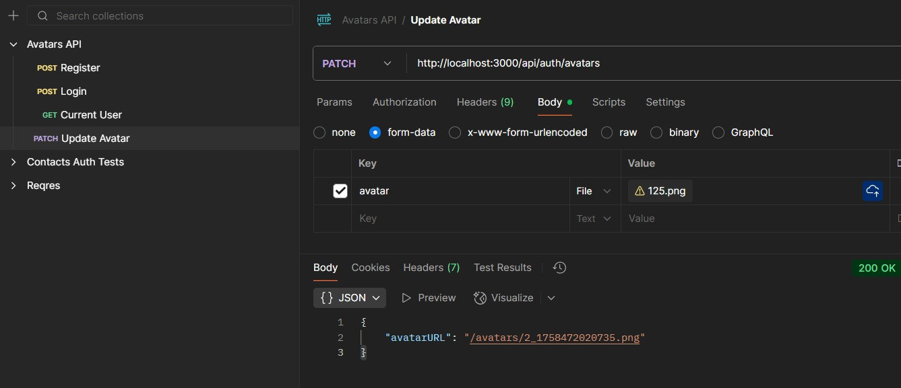
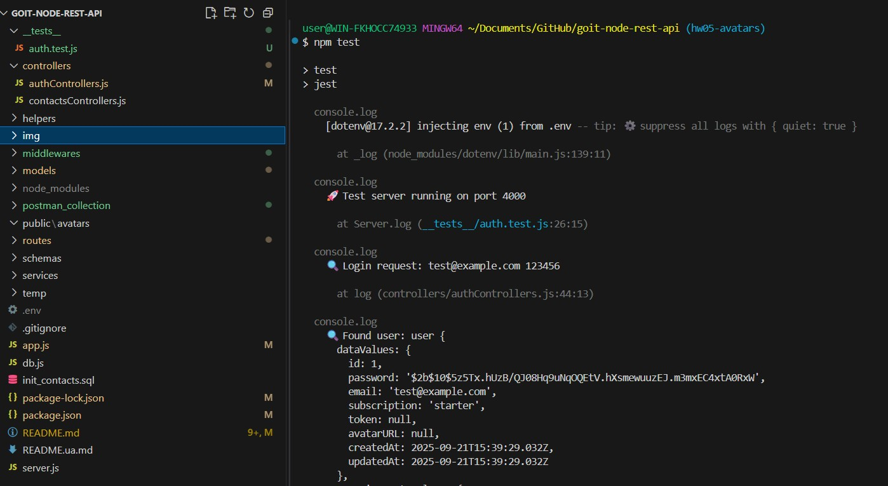
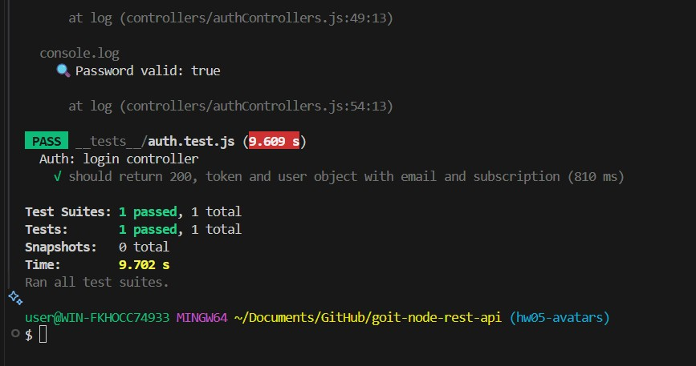

# Інструкція для перевірки ДЗ: REST API(4), PostgresSQL та Sequelize(6), Аутентифікація та авторизація(7), Робота з файлами та тестування додатків(9)

## Як запустити проєкт

npm install

### Як перевірити роботу API + РЕЗУЛЬТАТ

## Запускаємо сервер

npm start

або в режимі розробки (якщо додав nodemon):

npm run dev

### Якщо сервер працює коректно, тоді запускємо тести

npm test

Структура проекту

### Ендпоінти для перевірки

## Відкрий інший термінал і зроби кілька запитів

# Перевірка API через Postman (зручніше для перевірки)

Відкрий Postman

Імпортуй колекцію contacts_api.postman_collection.json

Там є готові запити:

GET /api/contacts

GET /api/contacts/:id

POST /api/contacts

PUT /api/contacts/:id

PATCH /api/contacts/:id/favorite

DELETE /api/contacts/:id

Запускай по черзі і дивись у відповідь (Response).

## Postman-запити для Auth API

# Реєстрація (Register)

POST http://localhost:3000/api/auth/register
Content-Type: application/json

# Логін (Login)

POST http://localhost:3000/api/auth/login
Content-Type: application/json

# Поточний користувач (Current User)

GET http://localhost:3000/api/auth/current
Authorization: Bearer JWT_TOKEN

# Логаут (Logout)

POST http://localhost:3000/api/auth/logout
Authorization: Bearer JWT_TOKEN

# Оновлення підписки (Update Subscription)

PATCH http://localhost:3000/api/auth/subscription
Authorization: Bearer JWT_TOKEN
Content-Type: application/json

### Тестування Auth + Avatar API через Postman

1. Реєстрація користувача
   POST `http://localhost:3000/api/auth/register`  
   Content-Type: application/json

   

2. Логін користувача
   POST http://localhost:3000/api/auth/login
   Content-Type: application/json

   

3. Отримання поточного користувача
   GET http://localhost:3000/api/auth/current

   

4. Оновлення аватарки
   PATCH http://localhost:3000/api/auth/avatars

   

# Тести C:\Users\user\Documents\GitHub\goit-node-rest-api\_\_tests\_\_\auth.test.js

