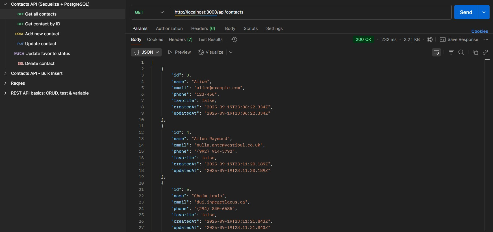
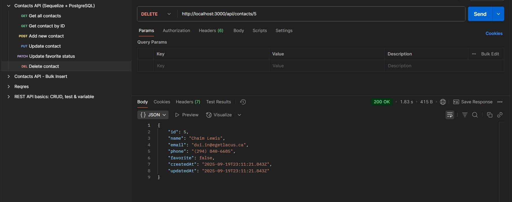

# Інструкція для перевірки ДЗ: REST API (Тема 4)

## Як запустити проєкт

npm install

### Як перевірити роботу API + РЕЗУЛЬТАТ

## Запускаємо сервер

npm start

або в режимі розробки (якщо додав nodemon):

npm run dev

Структура проекту

### Ендпоінти для перевірки

## Відкрий інший термінал і зроби кілька запитів

# Перевірка API через Postman (зручніше для перевірки)

Відкрий Postman

Імпортуй колекцію contacts_api.postman_collection.json

Там є готові запити:

GET /api/contacts

GET /api/contacts/:id

POST /api/contacts

PUT /api/contacts/:id

PATCH /api/contacts/:id/favorite

DELETE /api/contacts/:id

Запускай по черзі і дивись у відповідь (Response).

# Перевірка API через curl (альтернатива Postman)

У терміналі (Git Bash або PowerShell):

Отримати всі контакти:
curl http://localhost:3000/api/contacts

Додати контакт:
curl -X POST http://localhost:3000/api/contacts \
 -H "Content-Type: application/json" \
 -d '{"name":"Alice","email":"alice@example.com","phone":"123-456"}'

Отримати за ID (підстав свій id):
curl http://localhost:3000/api/contacts/1

Оновити весь контакт:
curl -X PUT http://localhost:3000/api/contacts/1 \
 -H "Content-Type: application/json" \
 -d '{"name":"Alice Updated","email":"alice2@example.com","phone":"555-999"}'

Оновити тільки favorite (Крок 4):
curl -X PATCH http://localhost:3000/api/contacts/1/favorite \
 -H "Content-Type: application/json" \
 -d '{"favorite": true}'

Видалити контакт:
curl -X DELETE http://localhost:3000/api/contacts/1
